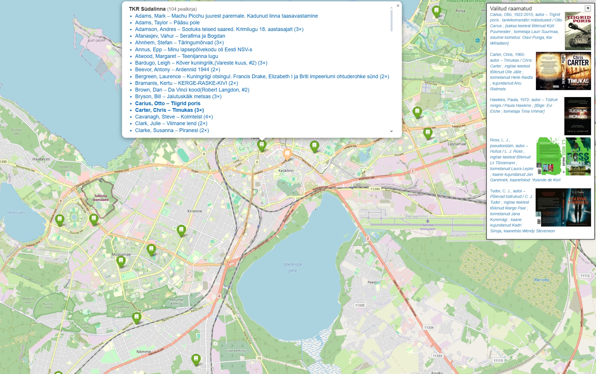
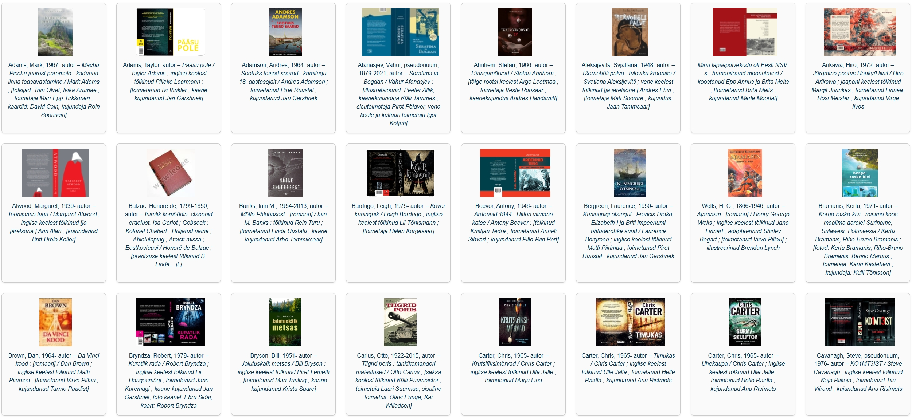

# Goodreads → ESTER Mapper 🇪🇪📚

Turn your **Goodreads “To‑Read” shelf** into an **interactive map** of every  
physical copy held by Estonian libraries – complete with cover thumbnails,  
availability status (*KOHAL / TÄHTAEG*) and a side‑panel “shopping list”.




---

## What it does

| Step | Action                 | Key points                                                                                         |
|------|------------------------|-----------------------------------------------------------------------------------------------------|
| **1**| Load titles            | Goodreads CSV **or** public shelf (`/review/list/<uid>?view=table`)                                 |
| **2**| Probe ESTER catalogue  | ISBN ⇒ single hit; else title‑index / keyword probes                                                |
| **3**| Reject noise           | Skips e‑resources, DVDs, CDs, online PDFs …                                                         |
| **4**| Fetch holdings         | Classic `…/holdings~` → “available copies” → *EPiK* JSON fallback                                   |
| **5**| Hunt jacket images     | inline `` → Avalanche/IIIF → Google Books (> 11 kB) → OpenLibrary → Google Images              |
| **6**| Save outputs           | Folium map, responsive cover gallery, console cover statistics                                      |

---

## Installation

```bash
git clone https://github.com/your-nick/goodreads-ester-mapper.git
cd goodreads-ester-mapper
python -m venv gr
source gr/bin/activate
pip install -r requirements.txt
```

Python 3.10 + recommended (pattern‑matching & modern typing).

---

## Quick start

```bash
# 1) Using a Goodreads CSV export
./goodreader.py --goodreads-csv my_to_read.csv

# 2) Using a public Goodreads shelf (no CSV needed)
./goodreader.py --goodreads-user <GOODREADS_USER_ID>
```

Open **`want_to_read_map.html`** in your browser and start exploring.  
Click any title in a pop‑up to add it to the temporary pick‑list panel.

---

## Command‑line options

| Option              | Default                  | Meaning                                   |
|---------------------|--------------------------|-------------------------------------------|
| `--max-titles N`    | all                      | Process at most *N* shelf rows            |
| `--threads N`       | 1                        | Parallel workers (be gentle with ESTER)   |
| `--geocode`         | _off_                    | Refresh lat/long even if cached           |
| `--output FILE`     | `want_to_read_map.html`  | Rename the map file                       |
| `--debug`           | _off_                    | Verbose crawl & comparator traces         |

---

## Output files

| File                        | Purpose                                                         |
|-----------------------------|-----------------------------------------------------------------|
| `want_to_read_map.html`     | Interactive Leaflet map (Folium)                                |
| `all_covers.html`           | Cover gallery (responsive CSS grid, lazy‑loaded images)         |
| `.geocache.json`            | Cached geocoding of branch addresses                            |
| `debug_empty_holdings.html` | *(with `--debug`)* first 1 kB of any empty holdings page         |

---

## Cover‑filter logic

Google Books occasionally serves a **10 549 B transparent placeholder** instead of
a real jacket.  
The code ignores any `books.google.com/books/content…` image **smaller than
11 kB** (and enforces a general ≥ 1 337 B minimum).

---

## Console output (short excerpt)

```text
ℹ 174 titles
[  1/174] Dick, Philip K. – Ubik
🔖 ISBN: — none —
🛰 probe title-idx      1 hit(s)
↳ https://www.ester.ee/search~S8*est/X?searchtype=t&searcharg=Ubik…
✓ 1 × KOHAL
⏳ 3.85s

[  2/174] Clarke, Susanna – Piranesi
🔖 ISBN: 9789916667620
🛰 probe keyword-isbn   1 hit(s)
↳ https://www.ester.ee/search~S8*est/X?searchtype=X&searcharg=9789916667620…
✓ 18 × KOHAL
⏳ 3.89s
```

---

## Cover‑stats excerpt

```text
ℹ Covers found: 164/170
• avalanche/inline 134  (81.7 %)
• gimages          21  (12.8 %)
• gbooks            9  ( 5.5 %)
```

---

## Development notes

* Python 3.10 +  
* Only public endpoints: ESTER HTML + one documented *EPiK* JSON call  
* Network re‑use via a shared `requests.Session()` with UA `goodreads-ester/<version>`

---

## License

MIT – see [`LICENSE`](LICENSE) for full text.
