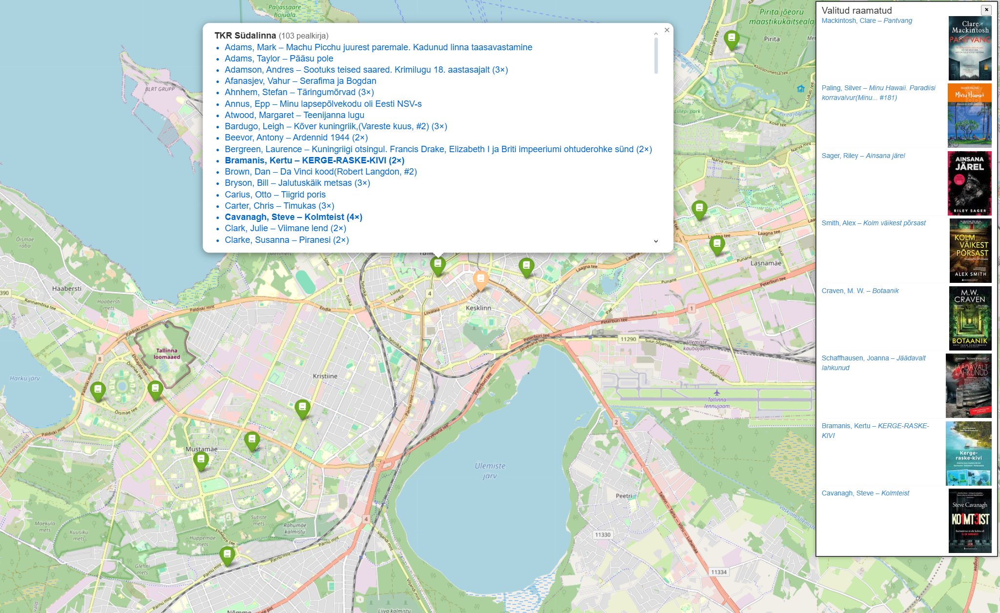
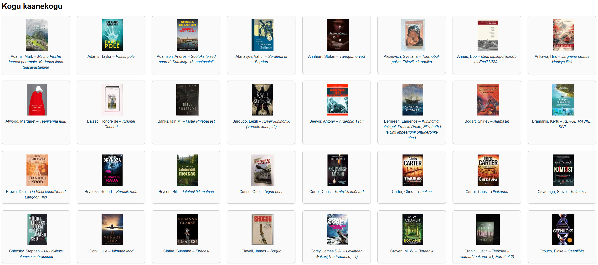

# Goodreads → ESTER Mapper 🇪🇪📚

Turn your **Goodreads “To‑Read” shelf** into an **interactive map** of every  
physical copy held by Estonian libraries – complete with cover thumbnails,  
availability status (*KOHAL / TÄHTAEG*) and a side‑panel “shopping list”.




---

## What it does

| Step | Action                    | Key points                                                                                           |
|------|---------------------------|-------------------------------------------------------------------------------------------------------|
| **1** | Load titles              | Goodreads CSV **or** public shelf (`/review/list/<uid>?view=table`)                                   |
| **2** | Probe ESTER catalogue    | ISBN ⇒ single hit; else title‑index / keyword probes                                                  |
| **3** | Reject noise             | Skips e‑resources, DVDs, CDs, online PDFs, …                                                          |
| **4** | Fetch holdings           | Classic `…/holdings~` → “available copies” → *EPiK* JSON fallback                                     |
| **5** | Hunt jacket images       | inline `` → Avalanche/IIIF → Google Books (> 11 kB) → OpenLibrary → Google Images               |
| **6** | Save outputs             | Folium map, responsive cover gallery, console cover statistics                                        |

---

## Installation

```bash
git clone https://github.com/your-nick/goodreads-ester-mapper.git
cd goodreads-ester-mapper
python -m venv gr
source gr/bin/activate
pip install -r requirements.txt
```

Python 3.10+ recommended (pattern‑matching & modern typing).

---

## Quick start

```bash
# 1) Using a Goodreads CSV export
./goodreader.py --goodreads-csv my_to_read.csv

# 2) Using a public Goodreads shelf (no CSV needed)
./goodreader.py --goodreads-user XXXXXXXXX # 👈 replace with *your* user-id
```

Open **`want_to_read_map.html`** in your browser and start exploring.  
Click any title in a pop‑up to add it to the temporary pick‑list panel.

---

## Command‑line options

| Option            | Default                | Meaning                                   |
|-------------------|------------------------|-------------------------------------------|
| `--max-titles N`  | all                    | Process at most *N* shelf rows            |
| `--threads N`     | 1                      | Parallel workers (be gentle with ESTER)   |
| `--geocode`       | _off_                  | Refresh lat/long even if cached           |
| `--output FILE`   | `want_to_read_map.html`| Rename the map file                       |
| `--debug`         | _off_                  | Verbose crawl & comparator traces         |

---

## Output files

| File                        | Purpose                                             |
|-----------------------------|-----------------------------------------------------|
| `want_to_read_map.html`     | Interactive Leaflet map (Folium)                    |
| `all_covers.html`           | Cover gallery (responsive CSS grid, lazy image load)|
| `.geocache.json`            | Cached geocoding of branch addresses                |
| `debug_empty_holdings.html` | *(with `--debug`)* first 1 kB of any empty holdings |

---

## Cover‑filter logic

Google Books sometimes serves a **10 549 B transparent placeholder** instead of
a real jacket.  
The code ignores any `books.google.com/books/content…` image **smaller than
11 kB** (and enforces a general ≥ 1 337 B minimum).

---

## Typical run (excerpt)

```text
ℹ Covers found: 164/170
• avalanche/inline 134  (81.7 %)
• gimages          21  (12.8 %)
• gbooks            9  ( 5.5 %)
```

---

## Development notes

* Python 3.10 +  
* Only public endpoints: ESTER HTML + one documented *EPiK* JSON call  
* Shared `requests.Session()` with UA `goodreads-ester/<version>`

---

## License

MIT – see `LICENSE` for full text.
